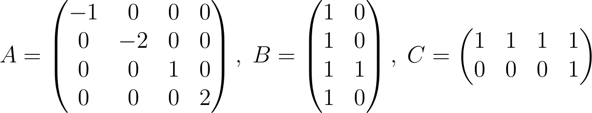

# Static Output Feedback
Static Output Feedback Controller Design Using Quantifier Elimination

This project contains the REDUCE source files for several decision problems occurring in static output feedback design of linear time-invaraint systems. The decision problems are formally solved using quantifier elimination.

## Prerequisites

You need to install the computer algebra system REDUCE. The REDUCE distribution is available for several operating systems:

http://reduce-algebra.sourceforge.net/

There are two main versions of REDUCE available, which are based on different Lips libraries:

Command | Library version 
:--- | :--- 
`redcsl`   | Codemist Standard Lisp (CSL) 
`redpsl`   | Portable Standard Lisp (PSL) 

The quantifier elimination is carried out using the package REDLOG. The program code is already part of REDUCE. The documentation can be found on the REDLOG website:

http://www.redlog.eu/

## Example

To illustrate our approach we modified Example 4.1 from the following reference:

Yannakoudakis, A. G.:
[*The static output feedback from the invariant point of view.*](https://doi.org/10.1093/imamci/dnu057)   
IMA Journal of Mathematical Control and Information 33(3):639-668, 2016.

The example systems consists of the following matrices:

 

We consider different structures of the 2×2 gain matrix:

 

## Contents

The [src](src) directory contains the source REDUCE files listed in the next table. These files differ in the geometry of the bounds and the problem formulation.

File | Description
:--- | :---
[`ex-place-arbitrary.red`](src/ex-place-arbitrary.red) | Test of arbitrary eigenvalue assignability
[`ex-place-special.red`](src/ex-place-special.red) | Test of a special eigenvalue assignability
[`ex-stab.red`](src/ex-stab.red) | Test of stabilizability
[`ex-stab-real.red`](src/ex-stab-real.red) | Test of real stabilizability

## Licence

This project is licensed under the GNU General Public License v3.0 - see the [LICENSE](LICENSE) file for details.